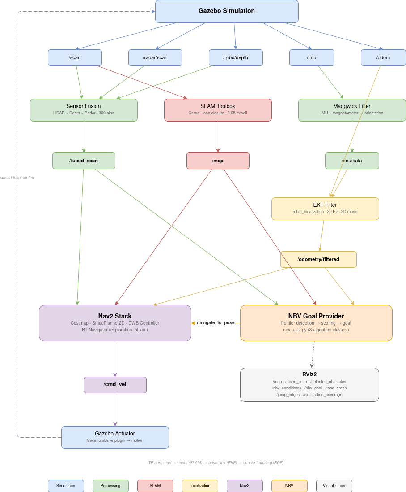
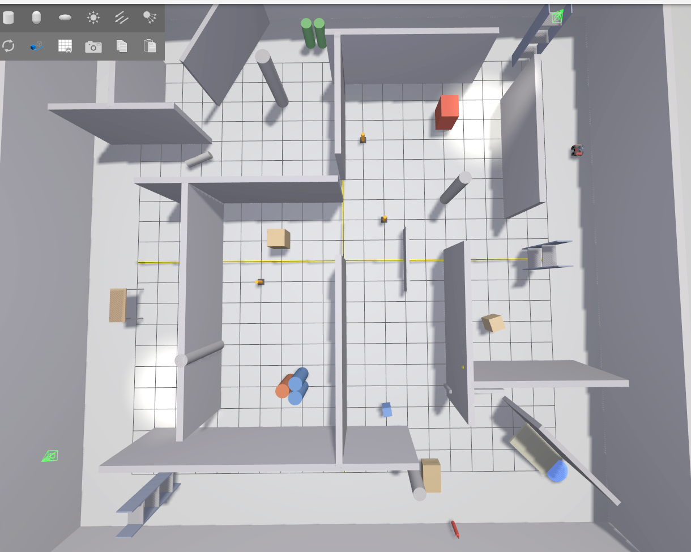
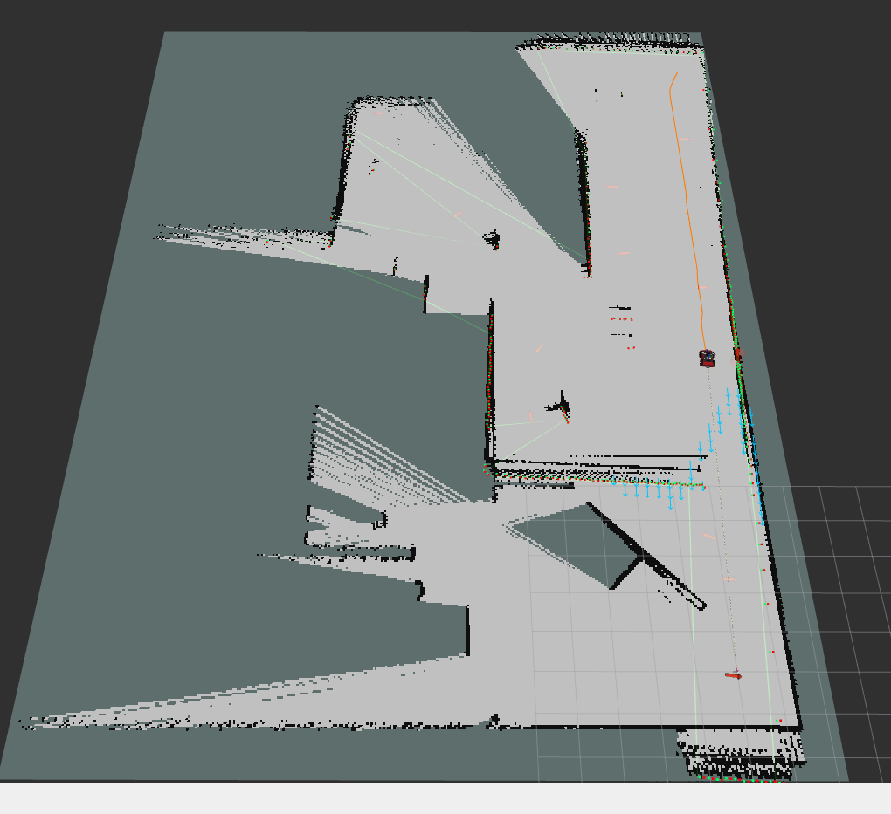

# ROS2 Autonomous Explorer

Autonomous exploration robot using Next-Best-View (NBV) planning, multi-sensor fusion, SLAM, and Nav2 navigation — simulated in Ignition Gazebo 6.

## Overview

A 4WD Mecanum holonomic robot that explores an unknown maze environment autonomously. It fuses LiDAR, radar, and RGB-D depth into a single scan, builds a 2D occupancy map with SLAM Toolbox, and continuously computes the next best viewpoint to maximise frontier coverage.

### System Data Flow



### Simulation Environment



### SLAM + RViz Visualization



## Project Structure

```
src/
├── autonomous_explorer/
│   ├── autonomous_explorer/    # Python library (nbv_utils, localization, mapping)
│   ├── scripts/                # ROS2 node executables
│   │   ├── obstacle_cluster_node.py   — LiDAR obstacle clustering
│   │   └── nbv_goal_provider_node.py  — NBV mission controller
│   ├── launch/
│   │   ├── nav2_exploration.launch.py — top-level orchestration
│   │   ├── localization.launch.py
│   │   ├── mapping.launch.py
│   │   └── navigation.launch.py
│   ├── config/                 # YAML parameters for all subsystems
│   └── urdf/                   # Robot model + Gazebo world
└── sensor_fusion/              # Multi-sensor fusion node
```

## Quick Start

### Prerequisites
- ROS2 Humble
- Ignition Gazebo 6 (Fortress)
- `ros-humble-nav2-*`, `ros-humble-slam-toolbox`, `ros-humble-robot-localization`

### Build

```bash
cd ~/ros2-autonomous-explorer
colcon build --packages-select autonomous_explorer sensor_fusion --symlink-install
source install/setup.bash
```

### Run

```bash
# Full system: Gazebo + SLAM + Nav2 + NBV exploration
ros2 launch autonomous_explorer nav2_exploration.launch.py

# With RViz
ros2 launch autonomous_explorer nav2_exploration.launch.py use_rviz:=true
```

Subsystems start in sequence:

| Time | Component |
|------|-----------|
| T+0s | Gazebo, sensor fusion, EKF localization |
| T+12s | SLAM Toolbox (waits for EKF TF) |
| T+17s | Nav2 stack (waits for `/map`) |
| T+22s | NBV goal provider (waits for Nav2 action server) |

## NBV Planning Library

Core algorithms in `autonomous_explorer/nbv_utils.py` (pure Python, no ROS2 deps):

| Class | Role |
|-------|------|
| `OccupancyMapper` | Bayesian log-odds grid synced from SLAM Toolbox |
| `OutlineExtractor` | Polar-sector frontier detection via jump edges |
| `CandidateGenerator` | NBV candidate placement at frontiers + uniform fallback |
| `NBVScorer` | Scores candidates by visibility (ray-casting), distance, and orientation |

## Robot Model

4WD Mecanum holonomic base (0.5 × 0.3 m, 3.0 kg)

| Sensor | Spec |
|--------|------|
| Hokuyo GPU LiDAR | 16-beam, 360°, 0.08–18 m, 40 Hz |
| 9-DOF IMU | Accelerometer + gyroscope + magnetometer |
| RGB-D Camera | 0.3–6 m depth range |
| Forward Radar | 90° FOV, 50 m range |

## Tech Stack

- ROS2 Humble · Ignition Gazebo 6 · Nav2 · SLAM Toolbox
- robot_localization EKF · imu_filter_madgwick
- Python 3.10 · NumPy · SciPy
